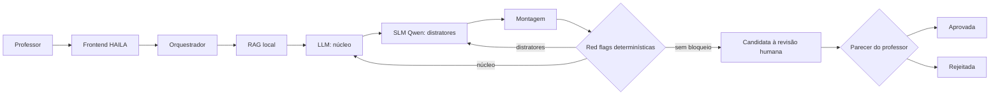

# HAILA

HAILA é uma arquitetura híbrida para gerar questões objetivas no formato ENADE com rastreabilidade e revisão humana. O código operacional está separado da interface e dos experimentos da pesquisa.

## Arquitetura



O RAG recupera uma referência do acervo local. A LLM produz enunciado, resposta correta e explicação. A SLM local produz os distratores. Regras determinísticas verificam estrutura, duplicidade, formatação, vazamentos e dependências ausentes. A aprovação pedagógica permanece humana.

## Pastas

- `backend/`: API, orquestração, RAG, geradores, regras e persistência.
- `frontend/`: HAILA Studio e proxy local restrito.
- `research/`: protocolos e componentes experimentais da dissertação.
- `docs/`: documentação da arquitetura e do contrato da API.
- `runtime/`: banco e saídas locais; não deve ser versionado.
- `archive/`: orientação sobre o código legado preservado.

## Execução

Crie e ative um ambiente Python, instale `backend/requirements.txt` e copie `.env.example` para `.env`. Depois, em dois terminais:

```bash
make backend
make frontend
```

A API ficará em `http://127.0.0.1:8000` e o HAILA Studio em `http://127.0.0.1:4173/studio.html`.

## Verificação

```bash
make test
```

Modelos que avaliam questões como substitutos de professores não fazem parte do fluxo de produção. Esse uso permanece em `research/` como protocolo experimental para comparação com pareceres humanos.
