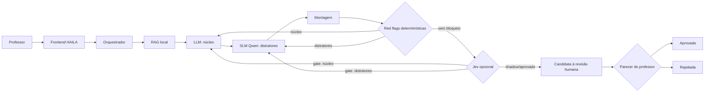

# HAILA

HAILA é uma arquitetura híbrida para gerar questões objetivas no formato ENADE com rastreabilidade e revisão humana. O código operacional está separado da interface e dos experimentos da pesquisa.

## Arquitetura


```mermaid
flowchart LR
    P[Professor] --> F[Frontend HAILA]
    F --> O[Orquestrador]
    O --> R[RAG local]
    R --> L[LLM: núcleo]
    L --> S[SLM Qwen: distratores]
    S --> M[Montagem]
    M --> D{Red flags determinísticas}
    D -->|sem bloqueio| J{Jev opcional}
    D -->|núcleo| L
    D -->|distratores| S
    J -->|shadow/aprovado| C[Candidata à revisão humana]
    J -->|gate: núcleo| L
    J -->|gate: distratores| S
    C --> H{Parecer do professor}
    H --> A[Aprovada]
    H --> X[Rejeitada]
```

O RAG recupera uma referência do acervo local. A LLM produz enunciado, resposta correta e explicação. A SLM local produz os distratores. Regras determinísticas verificam estrutura, duplicidade, formatação, vazamentos e dependências ausentes. A aprovação pedagógica permanece humana.

## Pastas

- `backend/`: API, orquestração, RAG, geradores, regras e persistência.
- `frontend/`: HAILA Studio e proxy local restrito.
- `research/`: protocolos e componentes experimentais da dissertação.
- `docs/`: documentação da arquitetura e do contrato da API.
- `runtime/`: banco e saídas locais; não deve ser versionado.

## Execução

Crie e ative um ambiente Python, instale `backend/requirements.txt` e copie `.env.example` para `.env`. Depois, em dois terminais:

```bash
make backend
make frontend
```

A API ficará em `http://127.0.0.1:8000` e o HAILA Studio em `http://127.0.0.1:4173/studio.html`.

## Verificação

```bash
make test
```

## Avaliação da dissertação

A campanha final foi avaliada com regras determinísticas, métricas textuais e Jev em modo shadow. A revisão humana faz parte da interface. A campanha final não incluiu avaliação docente.

## Jev experimental

A integração usa TypeSafe System One e cinco decisões `noul` em uma chamada:
unicidade do gabarito, clareza, alinhamento pedagógico, plausibilidade dos
distratores e ausência de ambiguidade.

Comece em `shadow`:

```bash
HAILA_JEV_ENABLED=1
HAILA_JEV_MODE=shadow
TYPESAFE_API_KEY=...
```

Em `shadow`, o Jev não bloqueia nem regenera. `gate` exige limiares
explicitamente configurados e calibrados contra avaliações docentes.

## Métricas da dissertação

Consulte as [tabelas e os gráficos](docs/metricas/README.md) da campanha final e o relatório separado da ablação de tokens.
