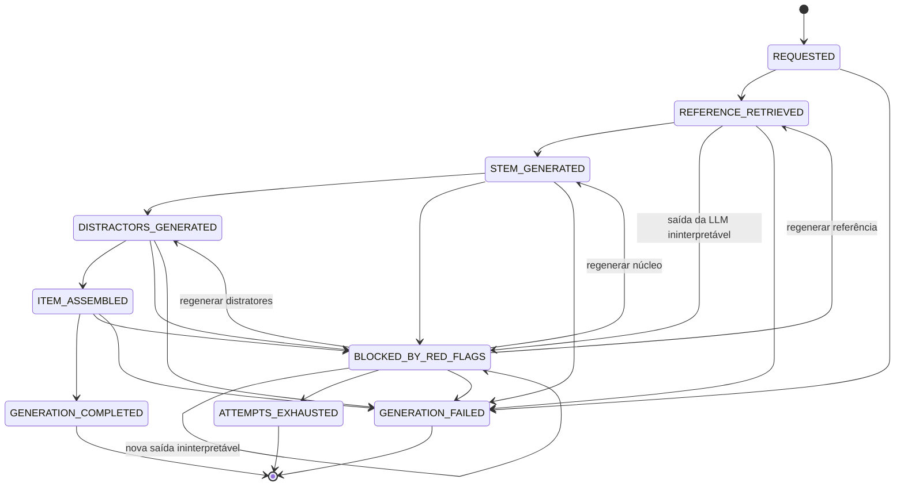

# Máquina de estados avaliada

Este diagrama representa diretamente os estados e as transições permitidas em `backend/haila/domain.py`. Ele é o oráculo comportamental da avaliação arquitetural.

## O que é verificado

1. Todos os estados definidos possuem regra de transição.
2. Todos os destinos são estados válidos e alcançáveis desde `REQUESTED`.
3. Estados terminais não possuem saída.
4. O repositório rejeita uma transição ilegal.
5. Cada histórico real começa em `REQUESTED`, segue apenas transições permitidas (autotransições só quando declaradas no modelo) e termina no estado persistido.
6. O estado persistido de cada solicitação auditada é terminal (`GENERATION_COMPLETED`, `ATTEMPTS_EXHAUSTED` ou `GENERATION_FAILED`).
7. Uma geração concluída possui referência, núcleo, distratores, resultado das red flags e uma versão com cinco alternativas e gabarito válido.

Esses critérios avaliam controle do fluxo, recuperação, persistência e rastreabilidade. A qualidade pedagógica das questões é avaliada separadamente por rubricas automáticas e, quando disponível, por professores.
